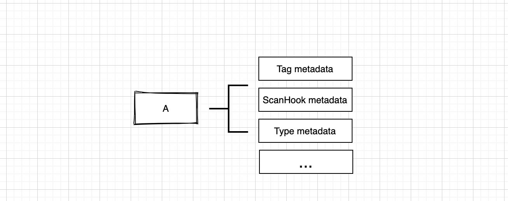
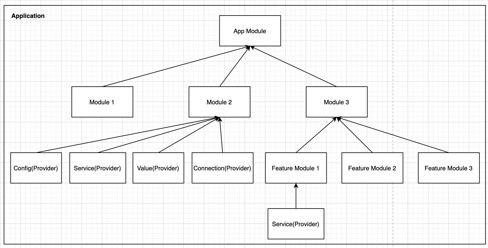
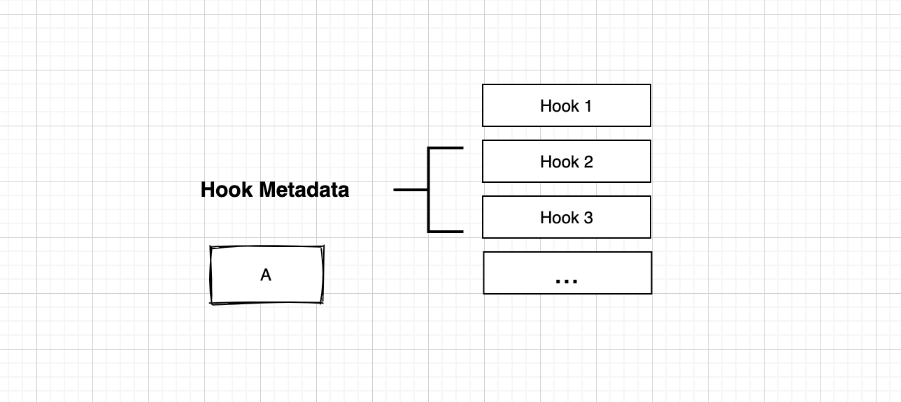
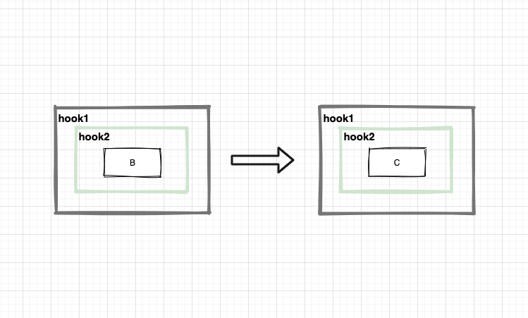

[](https://badge.fury.io/js/%40augejs%2Fprovider-scanner)


https://augejs.github.io/provider-scanner/

`provider-scanner` is a  Provider's metadata scan framework for nodeJs which is base on javascript `Reflect.defineMetadata`.

### Installation

You can get the latest release and the type definitions using npm:

```javascript
npm install @augejs/provider-scanner reflect-metadata --save
```

### What is a `Provider`

To be honest, I don't know what a `Provider` exactly is. Maybe an Entity, a File, a structure, a component, a service, or a string. What ever, it can be defined with kinds of metadata.

The `provider-scanner` just focus on the scan process with kinds of metadata. Finally the result is what we want.

```javascript
import { Metadata } from '@augejs/provider-scanner';

const employee = {
  fullName: 'xxxx',
  age: 12,
  headImageUrl: 'xxxx',
};
// here the employee structure consider as a provider

Metadata.defineMetadata(Metadata, 
{
  reporter: 'xxx',
  messageOwner: 'xxx'
}, employee);

// here we add a metadata to the employee structure.
```

A `Provider` can store kinds of `metadata` by using `Reflect.defineMetadata`.  (Also this behavior can be used by `Decorator`). 



### Organize Provider

Let's take a look at below diagram,  it a tree of `Provider`,  I think the tree structure is a good idea to organize things, thinking about the user-interface elements,  it's a tree structure. thinking about the computer file system, it's a tree structure.



> If the diagram means a school then the `Provider` means teachers and students. 
>
> If the diagram means a program then the `Provider` means logic unit.

### ParentMetadata

Here is a `Parent Metadata` which can define the children metadata to `Provider`

```javascript
import { ParentMetadata } from '@augejs/provider-scanner';

const employee = {
  fullName: 'xxxx',
  age: 12,
  headImageUrl: 'xxxx',
};
// here the employee structure consider as a provider

const manager = {
  fullName: 'xxxx',
  age: 54,
  headImageUrl: 'xxxx',
};
// here the manager structure consider as a provider

ParentMetadata.defineMetadata( 
[
  employee,
], manager);
// here we add the employee to the manager as this child node.

// we can easily use the `ParentMetadata` to build a tree structure which is composite of `providers` just the above diagram.
```

### ScanHookMetadata

Here is a `ScanHookMetadata` which can define the metadata `hooks` to `Provider`.
And the hook will execute in scan process.



#### Single Provider Hooks Execute Model

Go back to `Provider` , Maybe we need do some logic process  on `Provider` maybe process data, create new object, etc.  The below diagram show the idea. Each logic process is call a `hook`, hook can be nested, and all hooks of `Provider` share the data structure `ScanNode`  which can store some process results for current `Provider` 


> The hook execute order is A hook1-pre -> A hook2-pre -> A hook2-after->A hook1-after 


The `hook` idea here is from KOA, it just a middleware in KOA.

``` 
async (context: any, next:Function) {
  // some logic before
  await next();
  // some logic after
}
```

> The context here can get the current process ScanNode.


> Maybe this diagram can explain how a middleware works.

#### Sibling Provider Hooks Execute Model

Provider C is sibling of provide B



> The hook execute order is  B hooks -> C hooks

#### Parent Provider Hooks Execute Model

Provider A is parent of Provider B


> The hook execute order is is A hook1-pre -> A hook2-pre ->  ***B hooks***    -> A hook2-after->A hook1-after 
>
> the B  hooks seem is inner A


So finally, the scanner go through the provider tree and execute all the hooks around the provide. You can do every thing you want base on provider metadata and hooks to build anything.


> This is the `Provide Tree`(above diagram) scan execute order. It's like program  function execute process right?
